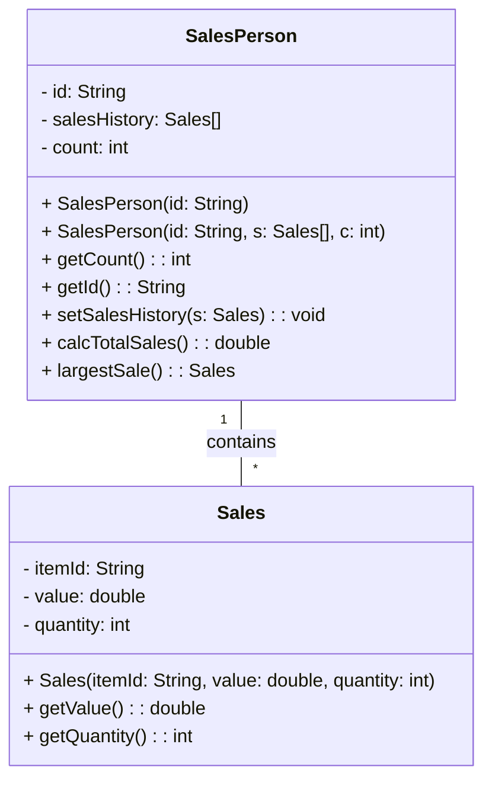

# Class Design and Implementation Case

#### A large company with locations in different cities has taken an OOP approach in creating an administration program that manages all aspects of its business. These aspects include:
#### · The sale of all the different products that the company manages
#### · The salaries for managers, office staff and sales personnel.

#### 1.
#### (a) By making use of an example from the above scenario, distinguish between a class and an instantiation of a class. (3 points)
> Class: A class is a blueprint or template that defines the structure and behavior of objects. It represents a concept or a category of objects that share common attributes and methods. In the given scenario, a class could be "Product" or "Employee," which define the common properties and behaviors for all products and employees in the company.

> Instantiation: Instantiation refers to the process of creating an object (instance) of a class. It involves allocating memory for the object and initializing its attributes based on the class definition. For example, if we have a class "Product," an instantiation of that class would be creating an object like "laptop" or "mobile phone," where each object has its specific attributes and values assigned.

#### The different modules in the program each open a graphical user interface (GUI). Each GUI has a similar design but contains differences specific to each module.

#### (b) By giving two examples, explain how the principles of inheritance can be incorporated into the design of this administration program. (4 points)
> Employee Class Inheritance: The program can have a base class called "Employee," which includes common attributes and methods for all types of employees (managers, office staff, sales personnel). Subclasses like "Manager," "OfficeStaff," and "SalesPerson" can inherit from the "Employee" class, inheriting its common attributes and methods while adding their specific functionalities.

> Product Class Inheritance: If the company manages different types of products, a base class called "Product" can be defined with common attributes and methods related to all products. Subclasses like "Electronics," "Clothing," and "Furniture" can inherit from the "Product" class, inheriting its common functionalities while adding their specific properties and behaviors.

#### (c) Describe how the use of libraries can facilitate the development of programs like this company’s administration program. (3 points)
> Libraries provide pre-written and tested code that can be reused in software development, saving time and effort. In the case of the administration program:

> GUI Libraries: The program can utilize GUI libraries like JavaFX or Tkinter to create the graphical user interfaces for different modules. These libraries provide ready-to-use components and functionalities, allowing developers to build consistent and user-friendly interfaces efficiently.

> Database Libraries: Libraries like JDBC (Java Database Connectivity) or SQLAlchemy (Python) can be used to interact with databases, facilitating tasks such as storing and retrieving product data, sales records, and employee information. These libraries abstract the complexities of database operations, making it easier to integrate database functionality into the program.

#### 2. The company employs several sales personnel to sell its products to different retailers. Each branch of the company keeps track of its own sales with a suite of programs that include the two #### classes SalesPerson and Sales.

 
```java
public class SalesPerson {

// each object contains details of one salesperson

private String id;

private Sales[] salesHistory; // details of the different sales

private int count = 0; // number of sales made


//constructor for a new salesperson

public SalesPerson(String id){

// code missing

}

 

// constructor for a salesperson transferred (together with their sales details) from another branch

public SalesPerson(String id, Sales[] s, int c){

// code missing

}

 

public int getCount(){return count;}

public String getId() {return id;}

public void setSalesHistory(Sales s){

salesHistory[count] = s;

count = count +1;

}

 

public double calcTotalSales(){

// calculates total sales for the salesperson

// code missing

}

 

public Sales largestSale(){

// calculates the sale with the largest value

// code missing

}

}
```
 
#### Each instance variable is initialized when a SalesPerson object is instantiated.

#### (a) Complete the constructor public SalesPerson(String id), from the SalesPerson class. (2 points)
> Code below:
```java
public SalesPerson(String id){
    this.id = id;
    this.salesHistory = new Sales[100]; // assuming a maximum of 100 sales can be stored
    this.count = 0;
}
```

#### (b) Explain why accessor methods are necessary for the SalesPerson class. (3 points)
> It's to provide controlled access to its private variables (id, salesHistory, count) from outside the class. These methods allow other parts of the program to retrieve and use the values of these variables without directly modifying them. This encapsulation ensures data integrity and provides a way to enforce business rules or perform validation checks when accessing or modifying the data.


```java
public class Sales {

// each object contains details of one sale

private String itemId;     // id of the item

private double value;      // the price of one item

private int quantity;      // the number of the items sold

// constructor missing

public double getValue() {return value;}

public int getQuantity() {return quantity;}

}
```

#### (c) (i) Construct unified modelling language (UML) diagrams to clearly show the relationship between the SalesPerson and Sales classes.

##### Note: There is no need to include mutator or accessor methods or a constructor. (4 points)
> UML using mermaid below:


#### (c) (ii) Outline a negative effect that a future change in the design of the Sales object might have on this suite of programs. (2 points)
> A negative effect of a future change in the design of the Sales object on this suite of programs could be the need to modify the SalesPerson class. Since the SalesPerson class has a dependency on the Sales class (through the salesHistory array), any changes in the Sales class's structure or behavior may require corresponding updates in the SalesPerson class to ensure compatibility and proper functioning of the program. This can lead to code modifications and potential issues if not handled carefully.


#### The company employs several sales personnel. The different salesPerson objects are held in the array salesPeople. The Driver class contains various methods that operate on the SalesPerson and Sales classes. The Driver class contains the following code:
```java
public static void main(String[] args){

SalesPerson[] salesPeople = new SalesPerson[6];

salesPeople[0] = new SalesPerson("100");

salesPeople[1] = new SalesPerson("101");

salesPeople[2] = new SalesPerson("102");

salesPeople[0].setSalesHistory(new Sales("A100",300.00,10));

salesPeople[0].setSalesHistory(new Sales("A200",1000.00,2));

salesPeople[1].setSalesHistory(new Sales("A300",2550.40,10));

System.out.println(salesPeople[2].getId());

System.out.println(salesPeople[0].getCount());

System.out.println(salesPeople[1].getSalesHistory(0).getValue());

System.out.println(salesPeople[0].calcTotalSales());

 }
```
#### (d) State the output after running this code. (4 points)
> The output after running the above code will be:
```
102
2
2550.4
1300.0
```

#### (e) Construct the method calcTotalSales(), in the SalesPerson class that calculates the total value of the sales for a specific SalesPerson object. (5 points)
> Code below:
```java
public double calcTotalSales() {
    double totalSales = 0.0;
    for (int i = 0; i < count; i++) {
        totalSales += salesHistory[i].getValue() * salesHistory[i].getQuantity();
    }
    return totalSales;
}
```

#### The salesPeople array contains 100 instantiated objects. The company wishes to reward the salesperson whose sales have the largest total value.

#### (f) By making use of any previously written methods, construct the method highest(), that returns the ID of the salesperson whose sales have the largest total value. (5 points)
> Code below:
```java
public static String highest(SalesPerson[] salesPeople) {
    double maxTotalSales = 0.0;
    String highestSalesPersonId = "";
    
    for (SalesPerson salesPerson : salesPeople) {
        double totalSales = salesPerson.calcTotalSales();
        if (totalSales > maxTotalSales) {
            maxTotalSales = totalSales;
            highestSalesPersonId = salesPerson.getId();
        }
    }
    
    return highestSalesPersonId;
}
```

#### (g) Construct the method addSales(Sales s, String id), in the Driver class, that will add a new Sales object s, to the salesperson with a specified ID.
##### Note: You can assume that the ID is a valid one. (4 points)
> Code below:
```java
public static void addSales(Sales s, String id, SalesPerson[] salesPeople) {
    for (SalesPerson salesPerson : salesPeople) {
        if (salesPerson.getId().equals(id)) {
            salesPerson.setSalesHistory(s);
            break;
        }
    }
}
```

#### A further class in this suite of programs is the Payroll class. This class is run at the end of each month to calculate each salesperson’s salary, which is based on the sales that have been made during that month.

#### (h) Suggest changes that must be made to the SalesPerson class and/or the Sales class to allow these calculations to be made. (3 points)
> SalesPerson Class: Add a new attribute salary to store the salary of each salesperson. This attribute can be initialized in the constructor or set using a setter method. Additionally, include a getter method to retrieve the salary value.
> Sales Class: No specific changes are required in the Sales class for salary calculations unless additional salary-related information needs to be associated with each sale.

#### (i) Discuss the use of polymorphism that occurs in this suite of programs. (3 points)
> It allows objects of different classes to be treated as objects of a common superclass. In the given scenario, polymorphism can be observed through the usage of arrays or collections that can hold objects of different subclasses of the SalesPerson class. For example, the salesPeople array in the Driver class can store objects of various salesperson subclasses, enabling the program to operate on them uniformly, regardless of their specific types. This flexibility and abstraction enhance code reusability and maintainability.
